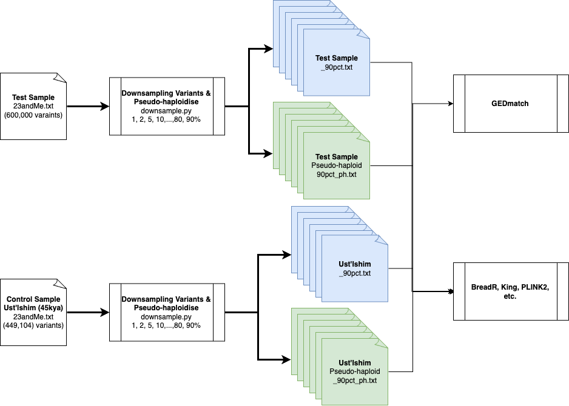

# GEDmatch Data Missingness Benchmarks
## Description
In this study, we test [GEDmatch](https://www.gedmatch.com/) performance with data missingness with both diploid and pseudo-haploid calls. Our primary questions are:
1. Does GEDmatch work with pseudo-haploid data?
2. How robust GEDmatch results are to data missingness? And at what level?

## Experimental Design
We will use one person's DNA, who is already in GEDmatch using 23andMe data. We will simulate random patterns of data missingness at 1%, 2%, 5%, 10%, ..., 80%, and 90%, both as diploid and pseudo-haploid at the same missingness levels. We will then test how robust the system is at detecting relatedness, with the expectation that the samples should be identified as monozygotic twins (MZ).

As a control, we will also upload an ancient, Ust'Ishim, a high-coverage ancient sample downsampled to intersecting 1240K capture loci (diploid calls) with the 23andMe array sites (420K SNPs), and simulate similar levels of missingness and test if this will yield any spurious matches. The sample was chosen as it is 45,000 years old and represents an extinct human lineage (Fu et al., Nature 2014).

## Study Design Overview



## Results
The downsampling code only relies on the polars python library. The arguments don't need to be in a specific ordre, and the outputs are writen to a file with the same name, with the suffix "_downsampled_Npct.txt" or "_downsampled_Npct_pseudohaploid.txt" where N is the percentage of missingness specified by the user. And can be used this way:

```{python}
python downsample.py -i sample.txt -s -p 50

# or using arguments full name
python downsample.py --calculate_stats --percentage_to_remove 50 --pseudo_haploid --input_file sample.txt
```

